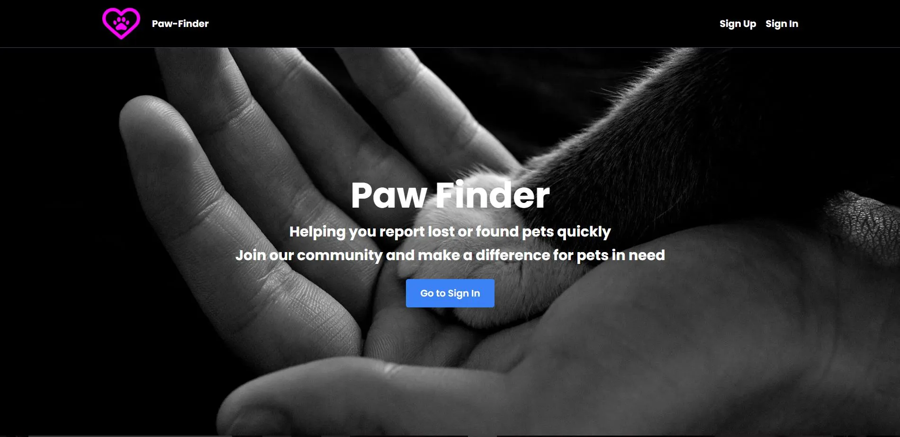
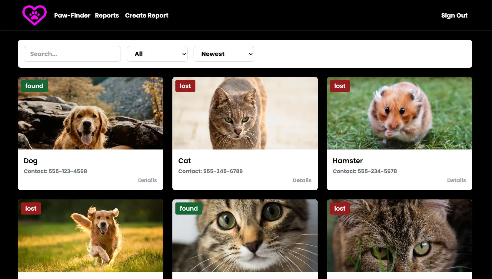

  <h1><a id='top'>Paw-Finder: Lost and Found Pet Reporting Platform</a></h1>




A full-stack application designed to connect users who have lost a pet with those who have found one. Users can create, view, and manage reports.

## 🚀 Features

* **Secure Authentication:** User sign-up and sign-in with **JWT** for session management.
* **CRUD Operations:** Users can **Create**, **Read**, **Update**, and **Delete** their own pet reports.
* **Real-Time Reporting:** New report creations are broadcast instantly to all active users using **Socket.IO**.
* **Comprehensive Reports Page:**
    * View a paginated list of all active reports.
    * Filter reports by **status** (lost/found), **order** (newest/oldest) and apply **search** queries.
    * Sort reports by various criteria.
* **Detailed View:** Modal window to view the full details of a specific report, including contact information and image.
* **User Authorization:** Ensures that users can only modify or delete reports they have created.
* **Responsive UI:** Built with **Tailwind CSS** for a modern, mobile-friendly design.

## 🛠️ Tech Stack

### 💻 Frontend (Client)

| Category | Technology |
| :--- | :--- |
| **Framework** | **React** |
| **State Management** | **Redux Toolkit** | 
| **Routing** | **React Router DOM** |
| **Styling** | **Tailwind CSS** |
| **API Client** | **Axios** | 
| **Real-Time** | **Socket.IO (Client)** |

### ⚙️ Backend (Server)

| Category | Technology |
| :--- | :--- |
| **Runtime** | **Node.js** | 
| **Framework** | **Express** |
| **Database** | **SQLite** | 
| **Security** | **JSON Web Tokens (JWT)** | 
| **Real-Time** | **Socket.IO (Server)** | 
| **Security/Config** | **CORS** |

📁 Installation and Setup

## Prerequisites

You must have the following software installed on your machine:

* **Node.js**
* **npm (Node Package Manager, installed with Node.js)**

## Clone the repository

```bash
git clone <https://github.com/manevardazaryan1/paw-finder.git>
```
## Navigate into the project folder

```bash
cd backend(backend)
cd frontend(frontend)
```

## Install dependencies

```bash
npm install
```
## Run the app locally

```bash
npm run dev
```

📡 API Endpoints

The backend is configured to use the base URL http://localhost:3000/.

Authentication Endpoints
These endpoints handle user registration and login, returning a JWT token upon successful sign-in.

| Method | Endpoint	| Description | 
| :--- | :--- | :--- |
| **POST** | **/api/auth/sign-up** | **Register a new user account.** |
| **POST** | **/api/auth/sign-in**	| **Authenticate a user and receive a JWT.** |

Reports EndpointsThese endpoints manage the creation, retrieval, and modification of pet reports. Note: All CRUD operations (except the main GET) require a valid JWT in the request headers for authentication and authorization.

| Method | Endpoint | Description |
| :--- | :--- | :--- |
| **GET**	| **/api/reports** | **Retrieve a paginated and filtered list of all reports.** |
| **POST**	| **/api/reports** | **Create a new pet report.** |
| **GET**	| **/api/reports/:id** | **Retrieve the details of a specific report.** |
| **PUT**	| **/api/reports/:id** | **Update an existing report. (Requires Authorization)** |
| **DELETE** | **/api/reports/:id** | **Delete a report. (Requires Authorization)** |

[Tap to Top ⬆](#top)